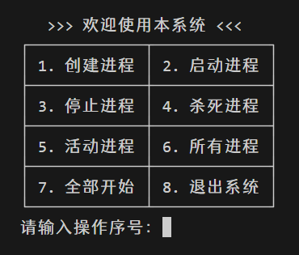

# 进程控制系统

- 开发日期：2023 年 4 月 6 日
- 作者：欧阳鹏
- 公众号：鹏优创

## 程序介绍

- 运行方式：编译运行 `process.c`
- 进程状态
  1. 准备就绪
  2. 正在运行
  3. 请求删除
- 相关解释
  - 准备一个 PCB 链表
  - PCB 包括名称、状态
  - 启动进程：将状态改为 2
  - 停止进程：将状态改为 1
  - 删除进程：从链表中删除该进程，状态标记为 3
  - 全部开始：全部进程状态改为 2